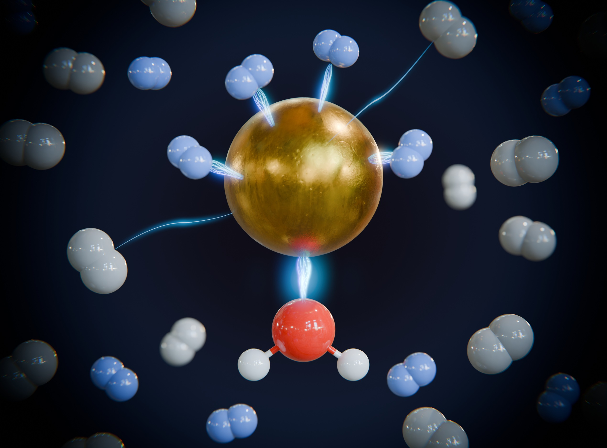

# Publications

You can also find my articles on my **[Google Scholar profile](https://scholar.google.com/citations?user=67h5w9AAAAAJ&hl=fr)**.

---

## 03 Publications

### [Direct evidence for ligand-enhanced activity of Cu(I) sites](https://pubs.rsc.org/en/content/articlelanding/2024/sc/d4sc04582c)

**E. G. Dongmo**, S. Haque, F. Kreuter, J. Jin, T. Wulf, R. Tonner-Zech, T. Heine, K. R. Asmis  
*Chemical Science*, 2024, 15, 14635–14643.

**DOI:** [10.1039/D4SC04582C](https://doi.org/10.1039/D4SC04582C)

**Discovery:** By probing dihydrogen adsorption at undercoordinated copper(I) sites, this work uncovers a strong influence of the ligand sphere and coordination geometry on both binding strength and dihydrogen isotopologue separation factors. I demonstrated that undercoordinated metal atoms interact more strongly with lighter isotopes than free ions. This research provides new insights into the rational design of next-generation hydrogen isotope separation technologies.

   

### [Prediction of strong Cu(I)–He interaction at open metal sites enables isotope-selective helium adsorption](https://www.nature.com/articles/s41467-026-70901-6)

**E. G. Dongmo**, S. Das, F. Moncada, T. Riemer-Wulf, T. Heine  
*Nature Communications*, **2026**, **17**, 2952.

**DOI:** [10.1038/s41467-026-70901-6](https://doi.org/10.1038/s41467-026-70901-6)

**Discovery:** Designed and implemented advanced numerical methods and scientific computing workflows by integrating finite-difference algorithms, high-performance simulations, state-of-the-art quantum chemistry calculations, and high-throughput computational screening. This work contributes to the development of clean-energy technologies, particularly nuclear fusion systems that rely on helium-3.

